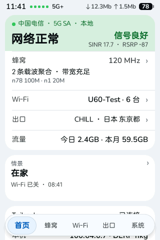
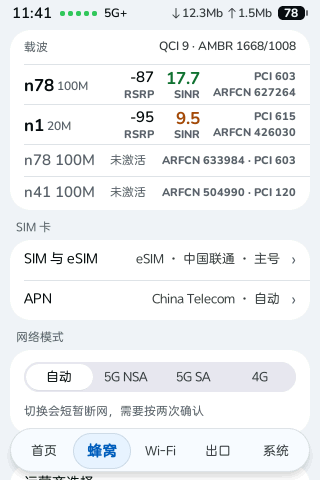
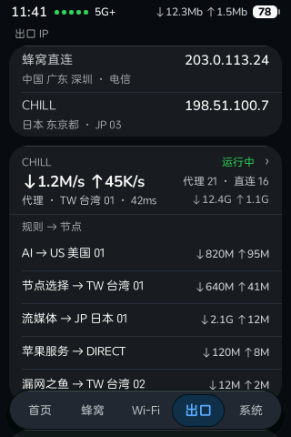
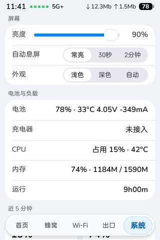

# ZTE U60 Pro（MU5250）触屏界面

中兴 U60 Pro（MU5250）前面板 3.5 寸触屏的开源替代界面：LVGL + FreeType，直接画到 DRM/KMS，编成一个静态 aarch64 程序，另附屏幕守护进程和设备端的进程监督、Wi-Fi 兜底脚本。

> 社区项目，和中兴（ZTE）没有关系，风险自负。

| 首页 | 蜂窝 | 出口（深色） | 系统 |
|---|---|---|---|
|  |  |  |  |

（截图由离屏渲染测试用假数据生成。）

## 三个仓库一起用

| 仓库 | 设备上的角色 |
|---|---|
| [manager](https://github.com/faying/zte-u60-pro-mu5250-manager) | `zte-agent`（:9090）+ 管理网页 + 装机包 |
| **[touch-ui](https://github.com/faying/zte-u60-pro-mu5250-touch-ui)**（本仓库） | 前面板触屏界面、屏幕守护进程、进程监督与 Wi-Fi 兜底脚本 |
| [data-service](https://github.com/faying/zte-u60-pro-mu5250-data-service) | `zwrt-datad`：本机数据服务（`127.0.0.1:9460` 的 `/state` + SSE） |

```
zwrt-datad :9460 ──▶ 触屏界面 ──(eSIM 页)──▶ zte-agent :9090 ──▶ lpac ──▶ eUICC 卡
浏览器 ──▶ zte-agent :9090（API + 管理网页）
```

触屏界面从 `zwrt-datad` 读实时数据，eSIM、CHILL、APN 等操作交给 `zte-agent`。三样由 manager 仓库的装机包一起装到设备上。

## 功能

- 底部 5 个标签，按「我想做什么」分：**首页 · 蜂窝 · Wi-Fi · 出口 · 系统**。首页大字是一句结论（网络正常 / 信号偏弱 / 漫游中）。
- 蜂窝：载波、信号、网络模式、APN、SIM 与 eSIM 切换（经 zte-agent 调 lpac）。
- 出口：CHILL（mihomo）状态、出口模式、档位、节点；Tailscale。
- 系统：亮度、息屏、浅色 / 深色 / 自动，电池与负载、告警详情。
- 每次点击都有即时反馈；要确认的操作按两次。
- **u60-uid**：屏幕唯一的主人。拉起或接管界面，崩了自动拉起并记告警；连续两次起不来就交还原厂界面（避免被固件升级成整机重启），长按屏幕右下角 3 秒回来。
- `scripts/`：procd 监督（`supervise.sh` + `*.init`）、Wi-Fi 兜底看门狗兼告警短信（`u60-guard.sh`）、只读体检（`doctor.sh`）、配置备份（`config-backup.sh`）等，约定见 manager 仓库的 [docs/RELIABILITY.md](https://github.com/faying/zte-u60-pro-mu5250-manager/blob/main/docs/RELIABILITY.md)。

## 快速开始

装到设备上请看 manager 仓库的 **[快速上手](https://github.com/faying/zte-u60-pro-mu5250-manager/blob/main/docs/GETTING-STARTED.md)**：本仓库编出的程序由那边的装机包带上设备，已装好的设备用 `./install.sh devui` 更新。

## 构建

用 Docker（镜像里有 Bootlin aarch64 musl 工具链和 FreeType 源码；Apple 芯片的 Mac 走 amd64 模拟，能用但慢）：

```sh
docker build --platform linux/amd64 -t u60-devui-build -f Dockerfile.build .
docker run --rm --platform linux/amd64 -v "$PWD":/src -w /src u60-devui-build bash -c '
  set -e
  [ -f third_party/lvgl/lvgl.h ] || git clone --depth 1 --branch v9.5.0 https://github.com/lvgl/lvgl.git third_party/lvgl
  HOME=/opt bash scripts/_build_freetype.sh
  make -j4 CROSS_COMPILE=aarch64-linux-
  make CROSS_COMPILE=aarch64-linux- u60-uid
  aarch64-linux-strip -o u60pro-devui.stripped u60pro-devui'
```

产物 `u60pro-devui.stripped`（界面）和 `u60-uid`（屏幕守护进程）。`scripts/build.sh` 编的是旧的 litehtml 版，装机包不收。

测试：`scripts/test/docker.sh`（设备端脚本，busybox 容器里全部打桩）、`make uid-test` / `make ui-logic-test`、
离屏渲染测试 `scripts/test/render/`（要设备字体，见脚本开头）。开发细节见 [docs/DEVELOPMENT.md](docs/DEVELOPMENT.md)。

> **新构建不要直接覆盖设备上的正式程序。** 一启动就崩的版本会被固件升级成整机重启循环；屏幕上几分钟没有界面，固件也会整机重启。
> 先用别的文件名试跑，步骤见 [docs/DEVELOPMENT.md](docs/DEVELOPMENT.md#在真机上试新版本)。

## 文档

- [docs/DEVELOPMENT.md](docs/DEVELOPMENT.md)：代码结构、构建、测试、真机试跑
- [docs/HARDWARE.md](docs/HARDWARE.md)：屏幕、触摸、按键、背光等硬件接口
- [docs/CHILL.md](docs/CHILL.md)：CHILL 页（mihomo 控制）
- [docs/ESIM.md](docs/ESIM.md)：eSIM 切换页与 zte-agent 接口
- [docs/SPEEDTEST.md](docs/SPEEDTEST.md)：可选测速后端
- 设计规范：manager 仓库 [docs/DESIGN.md](https://github.com/faying/zte-u60-pro-mu5250-manager/blob/main/docs/DESIGN.md) §4

## 致谢

- [33333s](https://github.com/33333s)：感谢 [u60pro-devui](https://github.com/33333s/u60pro-devui)（本仓库的起点）和 [zwrt-datad](https://github.com/33333s/zwrt-datad)（界面读取的本机数据服务）。
- Wei REN：LVGL 重写、u60-uid、CHILL、eSIM、Tailscale、可靠性脚本。
- [Jesther Silvestre](https://github.com/jesther-ai)：[open-u60-pro](https://github.com/jesther-ai/open-u60-pro)，zte-agent 的起点。

## 许可证与免责声明

[MIT](LICENSE)。LVGL（MIT）、FreeType（FTL / GPLv2）、stb（public domain）按各自许可证使用，详见 [NOTICE](NOTICE)。
仓库不含任何中兴字体或厂商二进制。和中兴通讯没有关系，只在你自己的设备上使用。
