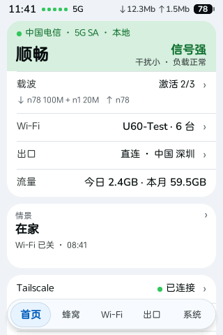
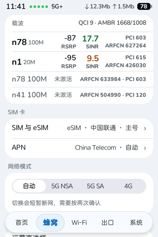
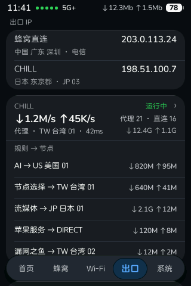
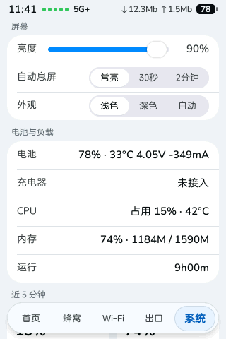

# ZTE U60 Pro (MU5250) Touch UI

**English** · [中文](README.zh-CN.md)

An open-source replacement UI for the 3.5-inch front-panel touchscreen of the ZTE U60 Pro (MU5250): LVGL + FreeType drawing straight to DRM/KMS, built as one static aarch64 binary, plus a screen owner daemon and on-device supervision and Wi-Fi fallback scripts.

> Community project. Not affiliated with ZTE. Use at your own risk.

| Home | Cellular | Exit (dark) | System |
|---|---|---|---|
|  |  |  |  |

(Screenshots are generated by the off-screen render tests using fake data.)

The on-screen text is Chinese only for now; an English option is planned.

## Part of a three-repo set

| Repo | Role on the device |
|---|---|
| [manager](https://github.com/faying/zte-u60-pro-mu5250-manager) | `zte-agent` (:9090), admin web, install kit |
| **[touch-ui](https://github.com/faying/zte-u60-pro-mu5250-touch-ui)** (this repo) | Front-panel touch UI, screen owner daemon, supervision and Wi-Fi fallback scripts |
| [data-service](https://github.com/faying/zte-u60-pro-mu5250-data-service) | `zwrt-datad`: local data service (`/v2/state` + SSE `/v2/events` on `127.0.0.1:9460`) |

```
zwrt-datad :9460 ──▶ touch UI ──(eSIM page)──▶ zte-agent :9090 ──▶ lpac ──▶ eUICC card
browser ──▶ zte-agent :9090 (API + admin web)
```

The touch UI reads live data from `zwrt-datad` and hands eSIM, APN and similar actions to `zte-agent`. The manager repo's install kit puts all three on the device together.

## Features

- Five bottom tabs, organised by what you want to do: **Home · Cellular · Wi-Fi · Exit · System**. The big line on Home is a one-sentence verdict, e.g. 「网络正常」 (network OK), 「信号偏弱」 (weak signal), 「漫游中」 (roaming).
- Cellular: carriers, signal, network mode, APN, SIM and eSIM switching (via zte-agent, which drives lpac).
- Exit: public exit IP and its location; Tailscale. No proxy features; if you want one, see [docs/PROXY.md](https://github.com/faying/zte-u60-pro-mu5250-manager/blob/main/docs/PROXY.md) in the manager repo.
- System: brightness, screen timeout, light / dark / auto theme, battery and load, alert details.
- Phone plugged into the USB-C port: like the stock screen, it asks what it is for — charge + internet (the phone gets a USB network), 18 W fast charging, or an Ethernet adapter — and can remember the answer (System › When a phone is plugged in).
- Every tap gets immediate feedback; actions that need confirming take two taps.
- **u60-uid**: the single owner of the screen. It starts or takes over the UI, restarts it after a crash and records an alert. If the UI fails to start twice in a row it hands the screen back to the stock UI (so the firmware does not escalate to a full reboot); long-press the bottom-right corner for 3 seconds to come back.
- `scripts/`: procd supervision (`supervise.sh` + `*.init`), the Wi-Fi fallback watchdog and alert SMS sender (`u60-guard.sh`), a read-only health check (`doctor.sh`), config backup (`config-backup.sh`) and more. The contract is in the manager repo's [docs/RELIABILITY.md](https://github.com/faying/zte-u60-pro-mu5250-manager/blob/main/docs/RELIABILITY.md).

## Quick start

To install on a device, follow the manager repo's **[getting-started guide](https://github.com/faying/zte-u60-pro-mu5250-manager/blob/main/docs/GETTING-STARTED.md)**. The binaries built here go onto the device with that install kit; on a device that is already set up, update with `./install.sh devui`.

## Build

With Docker (the image carries the Bootlin aarch64 musl toolchain and the FreeType source; Apple silicon Macs run it under amd64 emulation, which works but is slow):

```sh
scripts/build-docker.sh      # → out/u60pro-devui-lvgl.stripped (UI), out/u60-uid (screen owner daemon)
```

The script builds the image (`Dockerfile.build`: Bootlin aarch64 musl toolchain + static FreeType 2.13.3), copies the source into the container and builds there (LVGL pinned to v9.5.0).
It leaves no `.o` files in the repo and does not touch `third_party/`. The manager repo's `onboard/build-kit.sh` reads these two files from `out/` by default and runs this script when they are missing.
The touch UI fonts (Nunito and a CJK fallback) are generated by `scripts/fonts/build-nunito.sh` and `scripts/fonts/build-cjk-fallback.sh` (public downloads pinned by sha256); the install kit runs them automatically.

Tests: `scripts/test/docker.sh` (on-device scripts, fully stubbed in a busybox container), `make uid-test` / `make ui-logic-test`,
and the off-screen render tests in `scripts/test/render/` (need the device fonts; see the top of the script). Development details are in [docs/DEVELOPMENT.md](docs/DEVELOPMENT.md).

> **Never overwrite the live binary on the device with a new build.** A build that crashes on start is escalated by the firmware into a reboot loop, and a screen with no UI for a few minutes also triggers a full reboot.
> Test under a different file name first; the steps are in [docs/DEVELOPMENT.md](docs/DEVELOPMENT.md).

## Documentation

Each doc links to its Chinese copy (`*.zh-CN.md`).

- [docs/DEVELOPMENT.md](docs/DEVELOPMENT.md): code layout, build, tests, trying a build on a real device
- [docs/HARDWARE.md](docs/HARDWARE.md): screen, touch, buttons, backlight and other hardware interfaces
- [docs/ESIM.md](docs/ESIM.md): the eSIM switching page and the zte-agent API it uses
- [docs/SPEEDTEST.md](docs/SPEEDTEST.md): optional speed test backend
- Design spec: manager repo [docs/DESIGN.md](https://github.com/faying/zte-u60-pro-mu5250-manager/blob/main/docs/DESIGN.md) §4 (Chinese)

## Credits

- [33333s](https://github.com/33333s): thanks for [u60pro-devui](https://github.com/33333s/u60pro-devui) (the starting point of this repo) and [zwrt-datad](https://github.com/33333s/zwrt-datad) (the local data service the UI reads).
- Wei REN: LVGL rewrite, u60-uid, eSIM, Tailscale, reliability scripts.
- [Jesther Silvestre](https://github.com/jesther-ai): [open-u60-pro](https://github.com/jesther-ai/open-u60-pro), the starting point of zte-agent.

## License and disclaimer

[MIT](LICENSE). LVGL (MIT), FreeType (FTL / GPLv2) and stb (public domain) are used under their own licenses; see [NOTICE](NOTICE).
The repo contains no ZTE fonts or vendor binaries. Not affiliated with ZTE Corporation. Use only on your own device.
